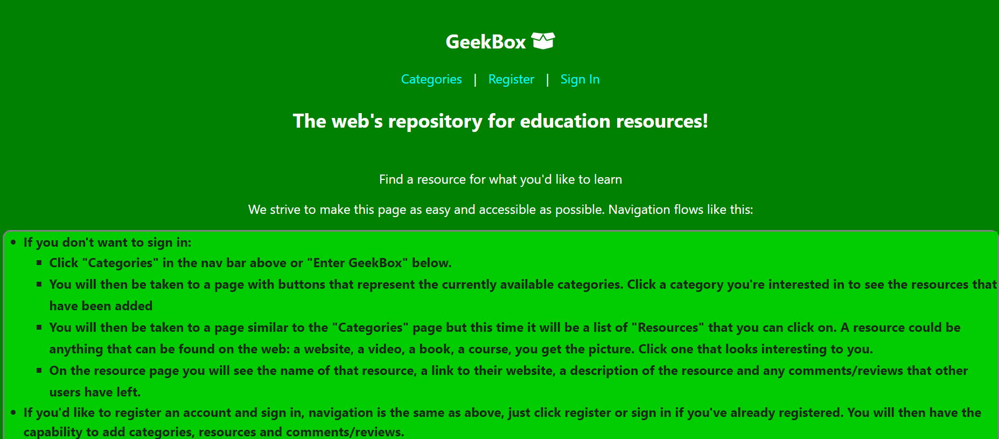

# GeekBox

[geekbox.now.sh](https://geekbox.now.sh)

## API Documentation

### /categories Endpoint

#### / Route

GET - Get all categories

POST - Post new category (Auth Token Required)

#### /:category_id Route

GET - Get single category by ID

DELETE - Delete individual category (Auth Token Required) - Not yet available to client, reserved for admin

PATCH - Edit category (Auth Token Required) - Not yet available to client, reserved for admin

### /resources Endpoint

#### / Route

GET - Get all resources

POST - Post new resource (Auth Token Required)

#### /:resource_id Route

GET - Get single resource by ID (Auth Token Required)

DELETE - Delete individual resource (Auth Token Required) - Not yet available to client, reserved for admin

PATCH - Edit resource (Auth Token Required) - Not yet available to client, reserved for admin

#### /:resource_id/comments

GET - Get comments for individual resource 

### /comments Endpoint

POST - Post comment for current resource (Auth Token Required) - resource_id required in request body

### /auth Endpoint

#### /signin Route

POST - Validates user and logs them in

### /users Endpoint

GET - Get list of all users (used for development, not available from front end)

POST - Adds newly registered user to database

## Summary

This application was created to aggregate educational resources available on the web by category.  It allows the user to optionally register an account and securely sign in.  Once authenticated the user can add categories and resources, as well as comment on and rate individual resources. If user should decline to sign in they can still browse the categories, resources and comments added by other users.

## Technologies

The technologies I've used here on the back end are NodeJS, Express, bcrypt, dotenv, helmet, jsonwebtoken, knex, morgan, treeize, xss and PostgreSQL.

I also used mocha, chai, nodemon, postgrator-cli and supertest during development.